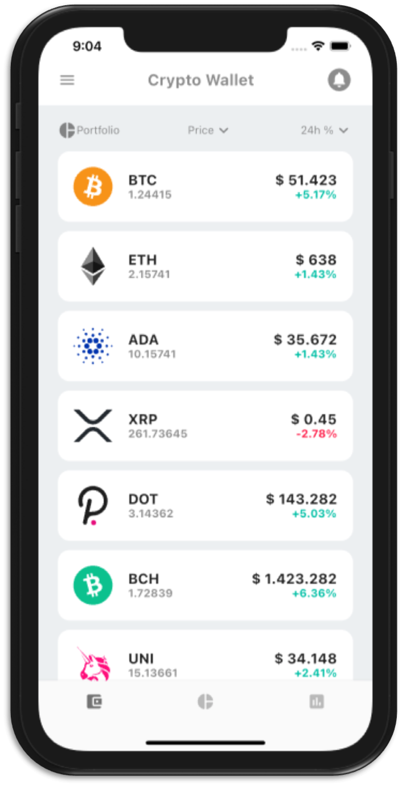
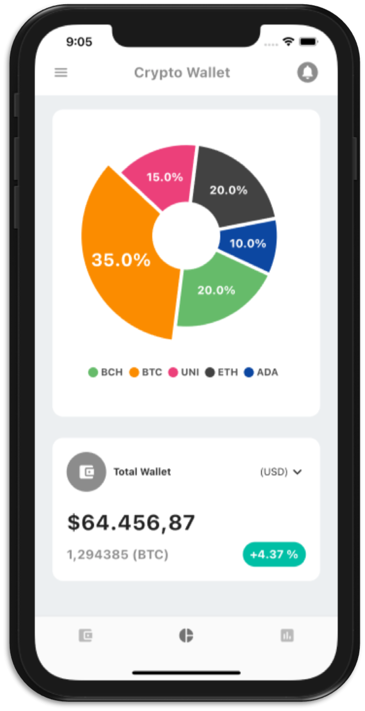

# UI Crypto Wallet

A new Flutter project.

## Image
<p align="center">



</p>

## Installation
To clone and run this project:
```sh
$ cd newProject
$ git clone https://github.com/pbmena/crypto_wallet.git
$ flutter run android|ios
```
[package/fl_chart/Readme]:<https://pub.dev/packages/fl_chart>

## Package
| Package  | Readme |
| ------   | ------ |
| fl_chart | [package/fl_chart/Readme] |
